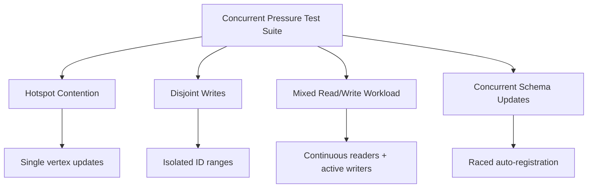

# Concurrent Transaction Pressure Testing Design

## 1. Problem Statement

RocksGraph employs **Optimistic Concurrency Control (OCC)** at the transaction commit boundary. Each transaction maintains an in-memory overlay of changes (vertices, edges, and properties) which are validated against RocksDB's state and flushed atomically on `commit()`. If another transaction committed changes to any of the same keys during this timeframe, the commit fails with a `StoreError::Conflict`.

While single-threaded unit tests verify individual operations, they cannot simulate real-world production environments where multiple threads concurrently read and write to shared datasets. A dedicated concurrent pressure testing suite is necessary to verify:
1. **OCC correctness**: Ensuring conflicts are correctly identified and no phantom updates or lost updates bypass validation.
2. **Deadlock freedom**: Verifying that internal synchronization mechanisms (like the schema `RwLock` or write paths) do not cause deadlocks under high contention.
3. **Data consistency invariants**: Confirming that the graph's structural integrity (like vertex degree counts and indices) is preserved when multiple threads concurrently add or remove vertices and edges.
4. **Retry & Backoff robustness**: Evaluating client-side transaction retry behavior under severe load.

---

## 2. Testing Scenarios

The suite divides transaction testing into four distinct contention profiles:



### 2.1 Hotspot Contention (High Conflict Rate)
*   **Goal**: Maximize the probability of transaction conflicts.
*   **Pattern**: $N$ threads concurrently attempt to fetch, increment, and write back a shared numeric property on the exact same vertex ID (e.g., `id: 0`).
*   **Validation**:
    - The client must implement a retry loop with exponential backoff to handle `StoreError::Conflict`.
    - Once all threads finish, the final value of the shared property must be exactly equal to the total number of successfully committed increments across all threads.

### 2.2 Disjoint Writes (Throughput / Low Conflict)
*   **Goal**: Test write path safety under parallel load with zero expected conflicts.
*   **Pattern**: Each thread is assigned a distinct ID space (e.g., Thread $i$ writes to range $[i \times 1000, (i+1) \times 1000]$). Threads add vertices and connect them with edges.
*   **Validation**:
    - Zero `StoreError::Conflict` errors should occur.
    - Post-test verification must confirm all created vertices and edges exist in the database, with correct properties and structural endpoints.

### 2.3 Mixed Read/Write Workload
*   **Goal**: Ensure Repeatable Read isolation holds for readers while writers are mutating the graph.
*   **Pattern**:
    - **Writers** continuously add, modify, and drop edges/vertices.
    - **Readers** run multi-step traversals (e.g., `g.V().out().out().count()`) or read snapshots.
*   **Validation**:
    - Readers must never observe partial or dirty writes (intermediate states of uncommitted transactions).
    - Repeatable reads must be maintained within the scope of each read transaction (`LogicalSnapshot`).

### 2.4 Concurrent Schema Updates
*   **Goal**: Stress-test the automatic schema registry lock boundaries.
*   **Pattern**: $N$ threads concurrently write to new, unregistered labels and property keys. This forces multiple threads to try to write to the schema catalog at the same time.
*   **Validation**:
    - The schema registry's `RwLock` must safely serialize updates without deadlocks.
    - The database must successfully register all new types, and subsequent transactions must be able to read/write properties matching those schema schemas.

---

## 3. Reference Implementation Architecture

The concurrent test harness is designed around standard Rust threading primitives to ensure high scheduling contention.

### 3.1 Synchronization and Coordination
*   **`std::sync::Barrier`**: Initiates worker threads at the exact same millisecond. Without this, early threads would complete their execution before later threads are fully spawned, reducing peak contention.
*   **`std::sync::atomic`**: Atomic counters (e.g., `AtomicUsize`) track successful commits, conflicts, and transaction execution times without introducing lock bottlenecks.
*   **Jittered Exponential Backoff**: Transactions must use jittered randomized backoffs when retrying after a `StoreError::Conflict` to avoid lockstep starvation.

### 3.2 Invariant Verification Pattern
The general flow of a pressure test must match this structure:

```rust
// 1. Initialize DB and declare base schema
let graph = Graph::open(temp_path)?;
setup_initial_state(&graph)?;

// 2. Initialize thread barrier and atomic trackers
let barrier = Arc::new(Barrier::new(num_threads));
let commit_counter = Arc::new(AtomicUsize::new(0));

// 3. Spawn workers
let mut handles = vec![];
for thread_idx in 0..num_threads {
    let graph = graph.clone();
    let barrier = Arc::clone(&barrier);
    let commit_counter = Arc::clone(&commit_counter);
    
    handles.push(std::thread::spawn(move || {
        barrier.wait(); // Start at the same time
        
        for _ in 0..iterations {
            let mut success = false;
            for attempt in 0..max_retries {
                let mut tx = graph.begin();
                
                // Perform read & mutation
                execute_operation(&mut tx, thread_idx)?;
                
                match tx.commit() {
                    Ok(_) => {
                        commit_counter.fetch_add(1, Ordering::SeqCst);
                        success = true;
                        break; // Success
                    }
                    Err(StoreError::Conflict) => {
                        // Apply backoff and retry
                        apply_backoff(attempt);
                    }
                    Err(e) => return Err(e),
                }
            }
            assert!(success, "Transaction starved and failed to commit");
        }
        Ok(())
    }));
}

// 4. Join threads
for h in handles {
    h.join().unwrap().unwrap();
}

// 5. Run single-threaded verification
let mut verify_tx = graph.begin();
assert_invariants(&mut verify_tx, commit_counter.load(Ordering::SeqCst))?;
```

---

## 4. Execution and Diagnostics

### 4.1 Running the Pressure Tests
Pressure tests are integrated under cargo:
*   To run integration pressure tests:
    ```bash
    cargo test --test concurrent_pressure
    ```
*   To run high-load write benchmarks:
    ```bash
    cargo run --bin bench_write -- --data-dir ./data --file-path ./graph.txt --parallelism 8
    ```

### 4.2 Diagnostic Metrics
To inspect transactional performance under load, the suite reports:
*   **Throughput**: Commits completed per second.
*   **Latency Distribution**: p50, p90, p95, p99, and max latency in microseconds (using the `hdrhistogram` crate).
*   **Conflict Rate**: Total conflicts divided by total successful transactions (shows the severity of contention).
